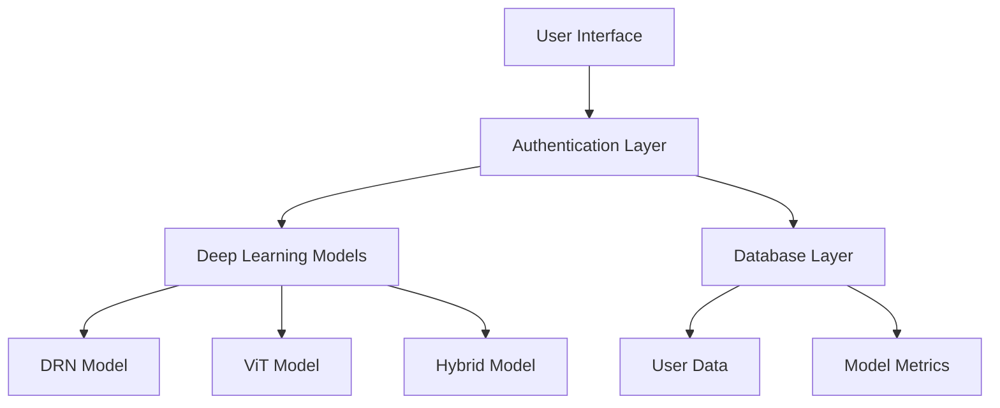
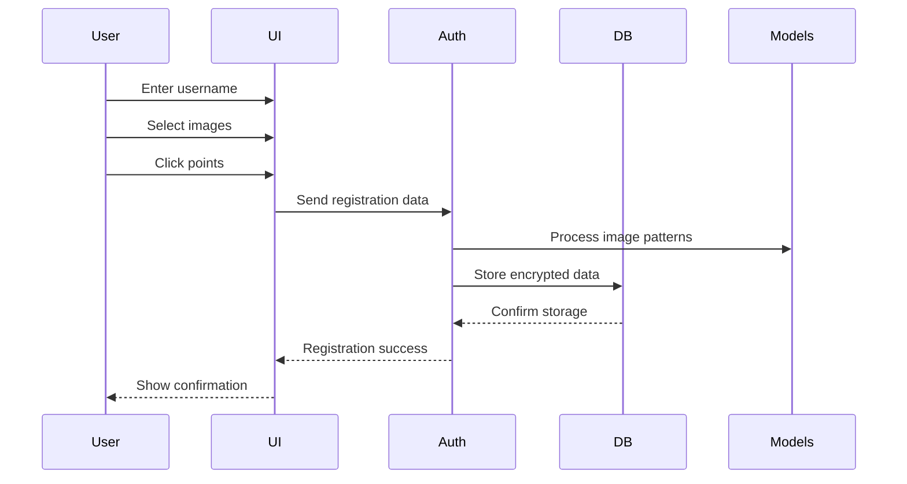
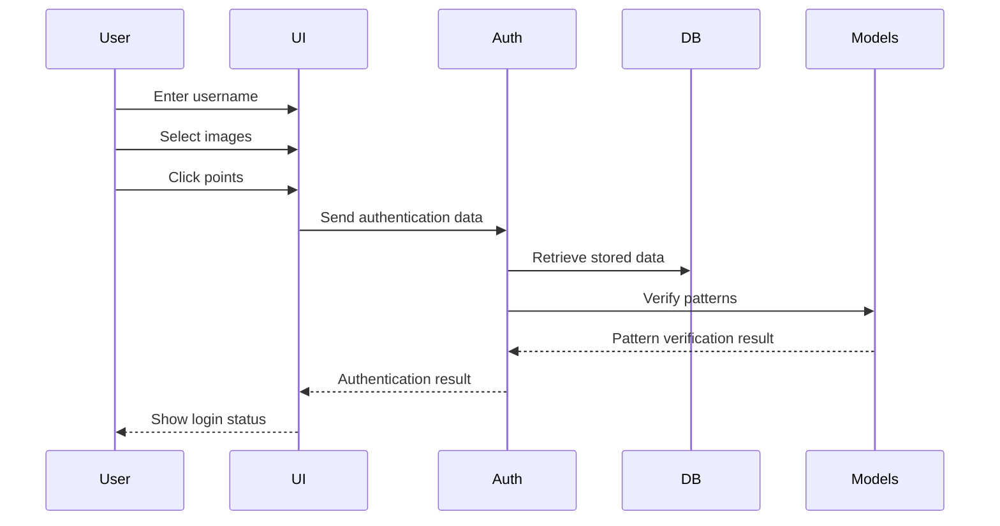
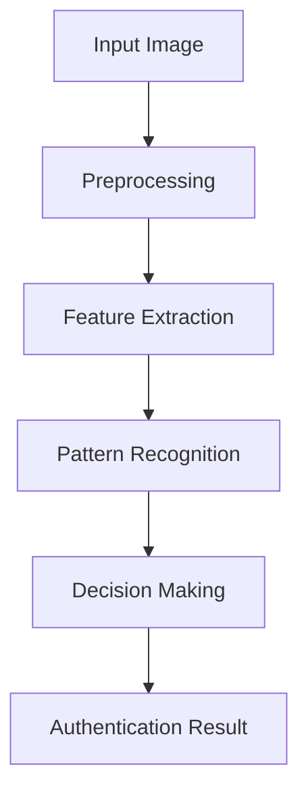
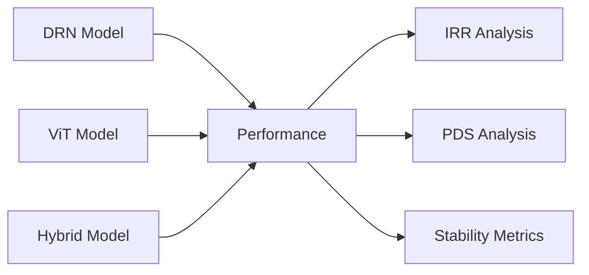
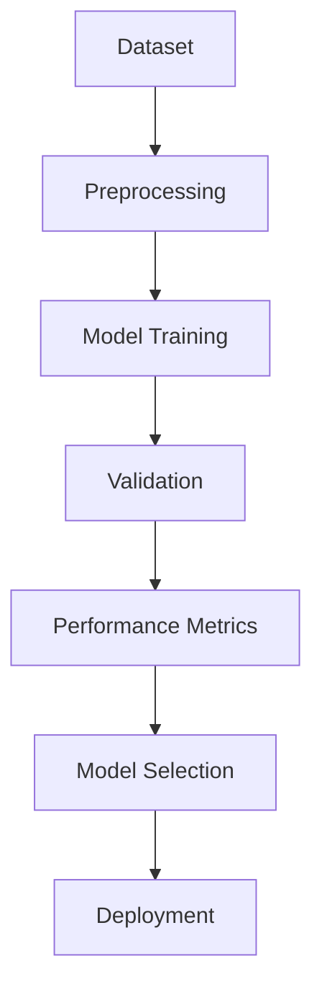

# Graphical Password Authentication System Methodology

## 1. System Overview

The Graphical Password Authentication System combines traditional password security with deep learning-based image recognition to create a robust and user-friendly authentication mechanism. The system employs a hybrid approach using both Deep Residual Networks (DRN) and Vision Transformers (ViT) for enhanced security and reliability.

## 2. System Architecture



### 2.1 Core Components

1. **User Interface (PyQt5)**
   - Interactive image selection and click point registration
   - Real-time feedback for user actions
   - Secure input handling

2. **Authentication Layer**
   - Password hashing using Argon2id
   - Click point validation
   - Image sequence verification
   - Security question handling

3. **Deep Learning Models**
   - Deep Residual Network (DRN)
   - Vision Transformer (ViT)
   - Hybrid Model combining DRN and ViT

4. **Database Layer (SQLite)**
   - User credentials storage
   - Encrypted click points
   - Model performance metrics
   - Security questions and answers

## 3. Authentication Flow

### 3.1 Registration Process



### 3.2 Login Process



## 4. Security Implementation

### 4.1 Password Security (Argon2id)

The system uses Argon2id for password hashing with the following parameters:
- Memory cost: 64MB
- Time cost: 3 iterations
- Parallelism: 4 threads
- Hash length: 32 bytes
- Salt length: 16 bytes

### 4.2 Click Point Security


- Points are encrypted using AES-256
- 20-pixel tolerance for click position verification
- Sequence validation for multiple images

### 4.3 Model Security



## 5. Performance Metrics

### 5.1 Information Retention Rate (IRR)

IRR measures the system's ability to maintain authentication accuracy under various conditions:

```
IRR = (Number of successful authentications) / (Total authentication attempts)
```

### 5.2 Password Diversity Score (PDS)

PDS evaluates the uniqueness and security of user-selected patterns:

```
PDS = 1 - (Number of similar patterns) / (Total number of patterns)
```

### 5.3 Model Performance Comparison



## 6. Implementation Details

### 6.1 Database Schema

```sql
CREATE TABLE users (
    username TEXT PRIMARY KEY,
    security_question TEXT NOT NULL,
    security_answer_hash TEXT NOT NULL,
    click_points TEXT NOT NULL,
    image_sequence TEXT NOT NULL,
    salt TEXT NOT NULL
);

CREATE TABLE model_metrics (
    username TEXT PRIMARY KEY,
    resnet_accuracy REAL,
    resnet_precision REAL,
    resnet_recall REAL,
    vit_accuracy REAL,
    vit_precision REAL,
    vit_recall REAL,
    timestamp DATETIME DEFAULT CURRENT_TIMESTAMP
);
```

### 6.2 Model Training Pipeline



## 7. Security Analysis

### 7.1 Attack Prevention

1. **Brute Force Attacks**
   - Argon2id memory-hard function
   - Rate limiting
   - Account lockout

2. **Pattern Analysis**
   - Encrypted click points
   - Image sequence randomization
   - Tolerance-based verification

3. **Model Security**
   - Regular model updates
   - Anomaly detection
   - Performance monitoring

## 8. Future Enhancements

1. **Model Improvements**
   - Adaptive learning rates
   - Dynamic tolerance adjustment
   - Enhanced pattern recognition

2. **Security Features**
   - Multi-factor authentication
   - Behavioral biometrics
   - Real-time threat detection

3. **Performance Optimization**
   - Parallel processing
   - Caching mechanisms
   - Resource optimization

## 9. Conclusion

The Graphical Password Authentication System provides a secure and user-friendly authentication mechanism by combining traditional password security with advanced deep learning models. The hybrid approach using DRN and ViT models ensures robust pattern recognition while maintaining high security standards through Argon2id hashing and encrypted click point storage. 